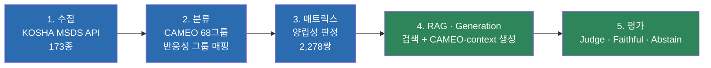

<div align="center">

# 🧪 MSDS 위험성평가 자동화

**화학물질들을 함께 두면 안전한가?** — KOSHA 공공데이터와 RAG로 답한다.

*포트폴리오 프로젝트 · 2026-07-29 ~ 진행중*

</div>

---

## 이 프로젝트가 푸는 문제

실험실·창고에서 일어나는 화학물질 혼재보관 사고는 물질 하나의 위험성이 아니라
**여러 물질을 같이 뒀을 때** 일어난다. 그런데 이 상호작용 정보는 흩어져 있다.
반응성 그룹 매트릭스(CAMEO)는 "위험/주의/안전" 딱지만 붙일 뿐 이유를 설명하지 않고,
정작 이유는 물질별 MSDS(물질안전보건자료) 원문 안에 글로 묻혀 있다.

이 프로젝트는 KOSHA(한국산업안전보건공단) 공개 MSDS 데이터와 CAMEO 68개 반응성 그룹
체계를 합쳐서, **물질을 2종 이상 입력하면 왜 위험한지 원문 근거와 함께 답하는
시스템**을 만든다. 근거가 부족하면 억지로 답하지 않고 **기각(Abstain)** 한다 —
안전 분야에서는 "모르겠다"고 말하는 것도 기능이다.

### 서비스 범위 (2026-08-28 확정)

물질을 임의로 줄인 게 아니라, **근거를 줄 수 있는 범위를 데이터로 결정**했다.

```
Registry 237종            CORE 5축 선정 기준을 통과한 후보
  ├─ Service 173종        KOSHA MSDS + CAMEO 매핑 모두 확보 -> 실제 검색·판정 대상
  └─ Unsupported 64종     KOSHA 미등재 39 / CAMEO 데이터 부재 25

Legacy corpus 89종        과거 평가 코퍼스에만 있던 물질. DB 보존, 서비스 제외
```

`service_eligible`은 사람이 손으로 켜는 값이 아니다. Registry·KOSHA·CAMEO 세 곳의
상태를 보고 자동으로 계산된다(`substance_status` VIEW). 인덱스가 만들어졌는지
(`chunks_ready`)는 이 자격의 조건이 아니라 결과를 확인하는 값이라 따로 둔다 — 청킹이
실패해도 "서비스 불가 물질"로 바뀌지 않고 `index_status='인덱스 결손'`으로 드러난다.
상세: [`docs/REGISTRY.md`](docs/REGISTRY.md)

> **타협 불가 원칙**: 매트릭스(CAMEO) 판정을 단독 최종 답변 근거로 쓰지 않는다.
> 매트릭스 판정은 "이미 정해진 값"으로 LLM에 주어지고, LLM은 그 판정을 다시 판단하지
> 않고 실제 MSDS §2/§10 근거로 **설명만** 한다. 판정의 근거와 설명의 근거를 나눠 두면,
> 설명이 근거를 벗어났을 때(hallucination) 그것만으로 실패로 잡을 수 있다. 착수일부터
> 바뀌지 않은 규칙이다. 상세:
> [`archive/superseded_docs/decisions.md`](archive/superseded_docs/decisions.md) §0.3

---

## 아키텍처 — 5단계 파이프라인



5단계 전부 최소 1회 이상 전수 실행·측정했다. 상세 흐름은
[`docs/PIPELINE.md`](docs/PIPELINE.md).

### 핵심 발견 — Retrieval이 아니라 Generation이 병목이었다

1차 라운드(baseline 프롬프트, LLM이 CAMEO 판정을 직접 다시 추론)에서 측정한 결과는
이랬다. Retrieval hit rate는 **98.84%**로 병목이 아닌데도 Generation 실패율이 훨씬
높았다. 실패는 두 가지 패턴이었다 — 근거가 있어도 답을 회피하거나
(**over-abstention 46.1%**), 개별 물질의 위험문구를 두 물질 사이의 반응성으로 잘못
읽어 위험을 과하게 판정하는 것(**30.9%**).

해법은 프롬프트를 다듬는 게 아니라 **역할을 바꾸는 것**이었다. LLM에게 판정을 맡기지
않고, CAMEO 반응성 그룹 조회(2,160건 전수에서 실제 정답과 **100% 일치**함을 확인)로
판정을 확정한 뒤 그 값을 컨텍스트에 넣고, LLM은 그 판정을 MSDS 근거로 **설명만** 하게
했다. 결과:

| 지표 | 1차(LLM이 직접 판정) | 최종(CAMEO-context, service) |
|---|---:|---:|
| 정답률(판정줄) | 19.8% | **99.9%** |
| 정답률(judge 재분류) | — | 83.9% |
| Over-abstention | 46.1% | 1.1% |
| Faithful(근거 밖 주장 없음) | 측정 안 됨 | **94.6%** |
| 물질 혼동 | 관측됨 | 14.7% |

> **service 기준, 2026-08-29 측정** — Upstage `solar-pro3` / 프롬프트
> `cameo_service_v6` / `corpus_tag='service'` 173종 / 2,240건 전수, 실패 0건.
> 정답률은 두 정의가 다르다: 답변 **판정줄**이 CAMEO 판정을 그대로 유지했는가(99.9%,
> 뒤집힌 판정 0건)와, judge가 **본문**을 다시 분류한 결과가 일치하는가(83.9%).
> 둘의 차이가 이 시스템에 남은 결함이다 — 판정은 지키는데 본문 서술이 판정보다 세다
> (Caution 745건 중 301건이 본문상 Incompatible로 읽힘). 물질 혼동 14.7%는 나빠진 게
> 아니라 **최초 측정치**다: 구 프롬프트는 인용 태그를 요구하지 않아 이 지표가 측정된
> 적이 없었다. 상세는 [`docs/GENERATION.md`](docs/GENERATION.md).
>
> 단, **왼쪽 "1차" 열은 173 코퍼스 기준(2026-08-17)이다.** 두 열은 코퍼스와 모델이
> 달라 엄밀한 대조가 아니며, 구조를 바꾼 방향을 보이는 용도로만 나란히 둔다.

전체 경위(prompt v2 시도 → 실패 → CAMEO-context 전환 → judge 채점버그 발견·수정 →
전수실행 429 재시도 강화 → 잔여 실패 표적 재시도)는
[`docs/GENERATION.md`](docs/GENERATION.md).

---

## 검색 계층 실측 결과

서비스 코퍼스(`corpus_tag='service'`, 173종 / 371청크) 기준. 물질 쌍 450쌍 × 5개 질의
템플릿 = 2,250질의 중 gold_evidence가 없는 10건을 뺀 2,240질의.

| 지표 | 쌍 질의 | **질의 분해** |
|---|---:|---:|
| Recall@10 | 0.8987 | **0.9888** |
| Hit@10 | 0.9790 | **1.0000** |
| MRR | 0.8803 | **0.9581** |
| nDCG@10 | 0.8065 | **0.9547** |
| 질의 임베딩 지연 | 444ms | 461ms(목표 500ms 충족) |
| 검색 지연 | 4.9ms | 11.2ms |

채점은 **evidence 기준**이다 — 정답은 §2 GHS 분류 청크뿐이고, §10은 정형문구라
"같은 문서의 무관한 청크가 검색돼도 Hit"으로 세지 않는다. 문서·섹션 단위
(gold_section) 기준 수치와는 정의가 달라 직접 비교할 수 없다.

> 지금 서비스는 사용자가 드롭다운에서 물질을 고르므로 두 CAS가 이미 정해져 있다.
> 그래서 검색을 거치지 않고 그 CAS의 MSDS를 DB에서 바로 조회한다. 검색 파이프라인은
> 자유 질의나 추가 근거가 필요할 때를 위해 그대로 남겨 둔다.
>
> 위 수치는 **검색 계층**의 실측이다. **서비스 경로**는 두 CAS의 §2·§10을 SQL로 직접
> 조회한다 — 정답 확보 100%, 제3물질 0%, 프롬프트 8,570자 → 3,170자, 질의 임베딩
> 461ms → 0ms. 나눈 이유는 아래 "검색을 안 쓰기로 한 이유".

```
검색 계층 (평가·확장)                    서비스 경로 (production)
  src/retrieval.py                         app/streamlit_app.py
  scripts/4_retrieval/run_ab.py                          explain(CAS_A, CAS_B)
  scripts/4_retrieval/freeze_retrieval.py                  └─ pair_context()   CAS 직접조회 §2+§10
  app: retrieve(query)
```

### 실패를 먼저 세어보고 고쳤다

베이스라인이 Hit@10 0.979인데도 **양쪽 물질의 근거를 다 확보한 비율은 67.9%**였다.
Hit은 "둘 중 하나만 찾아도" 세기 때문에 높게 보였던 것이다. 실패 2,240건을 top-50까지
확인해 보니 가장 많은 유형이 **"한쪽 물질의 §2만 검출"(22.4%)**이었고, 놓친 근거의
81%는 rank 11–20에 있었다 — 못 찾은 게 아니라 순위에서 밀린 것이다.

원인은 쌍 질의였다. 벡터 하나로 두 물질을 동시에 겨냥하니 한쪽이 밀린다. 물질명
하나만으로 물으면 171종 중 162종이 자기 §2를 1위로 가져온다. 그래서 쌍 질의를
**물질별 질의 2개로 나눠 각 top-5씩 교차 병합**했다 — 검색 예산은 그대로다. 리랭커는
붙이지 않았다: 분해만으로 Hit@10이 1.000이 돼서 더 얹을 여지가 없었다.

### 검색을 안 쓰기로 한 이유

분해로 순위는 잡혔는데 **한 가지가 안 풀렸다**. 컨텍스트의 60%가 그 쌍과 무관한
제3물질 청크였고(분해 전 65.8%), 이게 답변에서 남의 물질을 근거로 인용하는 문제의
원인이다. 코퍼스가 173종 371청크라 **물질당 청크가 2.1개**뿐이라서, 한 물질에 대해
top-2 이상을 요구하면 나머지는 남의 물질일 수밖에 없는 구조였다.

그래서 물질당 top-N을 줄여가며 다시 재봤더니, **검색을 아예 안 하는 쪽이 모든 항목에서
더 나았다.**

| 방식 | 청크 | 정답확보 | 제3물질 | 프롬프트 | 질의 임베딩 |
|---|---:|---:|---:|---:|---:|
| 분해 top-5/측 | 9.62 | 0.9888 | 60.1% | 8,570자 | 461ms |
| 분해 top-3/측 | 5.93 | 0.9821 | 44.5% | 5,326자 | 461ms |
| **CAS 직접조회 §2+§10** | **4.29** | **1.0000** | **0.0%** | **3,170자** | **0ms** |

이유는 단순하다. 정답 근거는 정의상 두 물질의 §2이고, 앱은 두 CAS를 **이미 알고
있다** — 사용자가 드롭다운에서 고른 값이다. 검색기는 이미 확정적으로 아는 것을 다시
찾고 있었고, 그 과정에서 남의 물질을 섞어 넣고 있었다. 여기서 검색은 정보를 더하지
않고 잃기만 한다.

**검색 계층을 지우지는 않았다.** 지표는 그대로 유효하고, 자유 텍스트 질의나 물질당
청크가 늘어나는 경우엔 다시 필요해진다. 다만 **지금 앱이 그 경로를 안 탄다는 사실을
숫자와 함께 적는다** — 이걸 안 적으면 검색 성능이 곧 제품 성능인 것처럼 읽힌다.

3종 이상 조합의 판정(매트릭스 조회)은 지원되지만, RAG 검색 자체의 실측 지표는
쌍(2종) 질의 기준까지만이다. 상세·실험 이력은 [`docs/RETRIEVAL.md`](docs/RETRIEVAL.md).

---

## N종(3종 이상) 물질 조합 지원

`src/compatibility_engine.py`의 `judge_combination_by_cas`가 입력 물질 전부를
쌍(pair)으로 쪼개 매트릭스로 판정한 뒤, worst-case 종합 + 전체 반응 매트릭스 표 +
쌍별 상세 리포트를 함께 낸다. 매트릭스 조회는 DB를 그대로 읽는 방식이라 N종에 바로
적용되지만, 위 검색 계층 실측은 여전히 쌍 단위라는 점은 구분해 표시한다.

---

## 결정을 바꾼 기록

결정이 틀렸을 때 왜 틀렸는지, 어떻게 다시 바꿨는지를 그대로 남겼다. 두 가지 사례:

> 검색 방식을 처음엔 "속도가 빠르다"는 이유로 dense 단독으로 정했다. 그런데 검색
> 범위를 좁히는 최적화를 하나 더 적용하고 나니 실측값이 **하이브리드가 7개 목표 중
> 6개, dense는 4개 충족**으로 뒤집혀, 결정 자체를 되돌렸다.

> Generation 채점에서 "faithful 9.5% 실패"가 나왔을 때, 프롬프트를 더 다듬기 전에
> 먼저 원인을 확인했다 — 채점기(judge)가 CAMEO 컨텍스트를 못 보고 MSDS 근거만 보고
> 채점하는 버그였다. 버그를 고치니 같은 13건 파일럿이 6/13 → 13/13 faithful로
> 바뀌었다.

이런 판단이 20건 넘게 쌓여 있고, 각각 "실측인지 사용자 결단인지", "출처가 있는지
없는지"를 구분해 기록했다.

| 문서 | 답하는 질문 |
|---|---|
| [`docs/PIPELINE.md`](docs/PIPELINE.md) | 전체 시스템은 어떻게 흘러가는가? |
| [`docs/REGISTRY.md`](docs/REGISTRY.md) | 어떤 물질을 다루는가? 넣고 빼는 기준은? |
| [`docs/DATA.md`](docs/DATA.md) | 데이터 원천은 무엇이고 어떻게 검증했는가? |
| [`docs/RETRIEVAL.md`](docs/RETRIEVAL.md) | 검색은 어떻게 설계했고 결과는 어땠는가? |
| [`docs/GENERATION.md`](docs/GENERATION.md) | 답변 생성과 평가를 어떻게 했는가? |
| [`docs/FILE_GUIDE.md`](docs/FILE_GUIDE.md) | 각 파일은 정확히 무엇을 하는가? |
| [`docs/HANDOFF.md`](docs/HANDOFF.md) | 현재 어디까지 왔는가? |
| [`docs/PROJECT_LOG.md`](docs/PROJECT_LOG.md) | 어떻게 발전했는가? |
| [`archive/`](archive/) | 폐기·기각 파일과 그 사유(분야별 정리, 원본 상세 문서 포함) |

---

## 기술 스택

| 영역 | 선택 | 비고 |
|---|---|---|
| 데이터 | KOSHA MSDS Open API, CAMEO 68그룹(PubChem 경로로 재검증) | 화학 도메인 원천 |
| 저장 | SQLite (`data/reactivity_reference.db`) | 관계형 진실원본 |
| 임베딩 | `dragonkue/BGE-m3-ko` | 한국어 특화, 사용자 지정 |
| 검색 | FAISS(dense) + BM25(kiwipiepy) + RRF 융합 + §10 boilerplate penalty | 하이브리드 |
| LLM | Upstage `solar-pro3`(reasoning_effort=high) | Generation + Judge 공용, OpenAI 호환 API |
| 평가 | 자체 rule+LLM Judge(faithful/predicted_verdict/substance_confused) | RAGAS는 파일럿 후 자체 채점기로 대체 |

---

## 디렉터리 구조

```
MSDS/
├─ README.md              # 이 문서
├─ docs/                  # 표준 문서 9종(위 표)
├─ src/                   # 재사용 핵심 모듈 (llm/retrieval/pipeline/eval_generation/
│                          # cameo_group_lookup/compatibility_engine)
├─ scripts/               # 실행 스크립트 24종 — 파이프라인 순서대로 폴더가 나뉜다
│   ├─ 1_collect/         #   KOSHA MSDS 수집
│   ├─ 2_registry/        #   물질 선정 · CAMEO 매핑 · 서비스 계약 감사
│   ├─ 3_corpus/          #   DB 시드 · 코퍼스 정의 · 임베딩 인덱스
│   ├─ 4_retrieval/       #   평가셋 · 검색 평가 · 입력 고정
│   ├─ 5_generation/      #   프롬프트 정의 · 전수 생성
│   └─ 6_eval/            #   채점 · 요약 · 리포트
├─ tests/                 # 자가검증 4종 (pipeline/collector/evalset/run_cameo 재개)
├─ app/                   # Streamlit 조회·판정 UI
├─ data/                  # DB·평가셋·선정 기준 CSV (+ 미추적 캐시 chunks/ index/)
├─ results/               # 최종 결과만 12개 — 무엇이 어느 수치의 근거인지는 results/README.md
└─ archive/               # 대체·폐기된 파일과 사유(폴더마다 NOTES.md)
```

전체 파일 목록과 역할은 [`docs/FILE_GUIDE.md`](docs/FILE_GUIDE.md),
결과 파일과 지표의 대응은 [`results/README.md`](results/README.md).

---

## 실행

```bash
# 1) .env에 UPSTAGE_API_KEY 설정 후 연결 확인
python src/llm.py --check

# 2) Retrieval 재현(캐시된 임베딩/인덱스 사용)
python scripts/4_retrieval/run_ab.py embedding --models bge-m3-ko --granularity section --task pair --sections 2,10 --corpus-tag service

# 3) Generation 입력 고정 -> 생성 -> 채점 (각 단계는 이어서 실행 가능, 실패분만 재시도됨)
#    worker 수는 Upstage 레이트리밋(100 RPM / 250,000 TPM)에 맞춘 값이다.
#    채점은 호출당 5.3k 토큰 x 1.3초라 worker 1개가 이미 TPM 상한이다.
python scripts/4_retrieval/freeze_retrieval.py --corpus-tag service
python scripts/5_generation/run_cameo_full.py --stage gen  --workers 7
python scripts/5_generation/run_cameo_full.py --stage eval --workers 1
python scripts/6_eval/reparse_verdict_line.py --gen results/generation_cameo_full.jsonl --eval results/eval_cameo_full.jsonl --out results/eval_cameo_full_reparsed.jsonl
python scripts/6_eval/summarize_cameo_full.py --gen results/generation_cameo_full.jsonl --eval results/eval_cameo_full_reparsed.jsonl

# 3-b) 재실행 없이 아래 확정 지표만 확인하려면 인자 없이 (기본값이 아카이브된 v6 산출물이다)
python scripts/6_eval/summarize_cameo_full.py --eval archive/2026-08-29_generation_prompt_history/v6/eval_cameo_full_reparsed.jsonl

# 4) Demo UI (물질 선택 -> CAMEO 판정 -> MSDS 근거 검색 -> LLM 설명)
streamlit run app/streamlit_app.py
```

---

## 지금까지 완성된 것 / 아직인 것

**완성**
- [x] Substance Registry **CORE 237종 확정** — 5축 선정 기준, 서비스 대상 198종
      ([`docs/REGISTRY.md`](docs/REGISTRY.md))
- [x] **서비스 계약 A티어 173종** — CAMEO 매핑이 있는 서비스 대상 전량이 상세·검색·판정
      3조건을 모두 충족(2026-08-22, B1 티어 해소)
- [x] KOSHA MSDS §2/§3/§9/§10 상세 연동 — Registry 198종 전량 수집, 앱에서 물질별 조회
- [x] KOSHA MSDS 173종 평가 코퍼스(수집 자체는 더 넓은 풀에서 진행, 평가셋은 173종 확정)
- [x] CAMEO 68그룹 · 양립성 매트릭스 2,278쌍, PubChem 경로로 94% 재검증
- [x] RAG 검색 계층 — hybrid, service 코퍼스 기준 Recall@10 0.8987 / Hit@10 0.9790
- [x] Generation 계층 — CAMEO-context 파이프라인, **service 기준** 정답률(판정줄)
      99.9% / 정답률(judge) 83.9% / faithful 94.6% (2026-08-29, 2,240건 전수)
- [x] N종(3종 이상) 물질 조합 판정(`judge_combination_by_cas`/`full_report`)
- [x] 자체 Judge 채점 파이프라인(rule + LLM, faithful/predicted_verdict/substance_confused)

**미완성**
- [ ] **본문 서술이 판정보다 강한 문제 (최대 결함)** — 판정줄 기준 오답은 0건이지만,
      matrix=Caution 745건 중 **301건이 본문상 Incompatible로 읽힌다**(judge 재분류).
      판정줄은 그 301건 모두 Caution으로 정확히 썼다. 판정줄–본문 일치 82.9%
- [ ] **물질 혼동 14.7%** (307/2,093) — 검색 top-10에 섞인 제3물질 청크를 이 쌍의
      근거로 인용한다. 2026-08-29에 프롬프트가 인용 태그를 요구하게 되면서 **처음
      측정된 값**이다(그전에는 0%가 아니라 측정 불가였다). 태그 미출력 6.2%는 여전히 측정 불가
- [ ] Reranker 미실행 — 저비용 대안(boilerplate penalty)으로 이미 목표 충족해 보류 중
- [ ] 잔여 faithful 실패 5.4%(120건, service 기준) — 패턴은 파악됐으나(그룹 분류를
      확인된 반응처럼 단정) 완전히 해소되진 않음. 173/Nemotron 때는 2.8%였다
- [ ] Registry 237종 중 **CAMEO 매핑 173종(73.0%)** — 2026-08-22에 PubChem `hid=86`으로
      142 → 173종으로 늘려 판정 가능 쌍은 51.3% → **76.3%**(14,878/19,503). 남은 25종은
      CAMEO에 데이터시트 자체가 없어(원소 23종 + 탄산나트륨 + 염화나트륨) **76.3%를 현재
      coverage로 확정**했다 — PubChem `hid=86`과 CAMEO 자체 색인 두 경로로 원천 부재 확인
- [ ] 원본 리스트 전체(173종 이전 풀) 안전성 재검증 미완
- [ ] RAGAS 기반 지표(Faithfulness/Context Precision 등)는 n=7 파일럿 이후 중단,
      자체 Judge로 대체된 채 재개 안 함(사유: [`archive/generation_experiments/NOTES.md`](archive/generation_experiments/NOTES.md))

상세 목록은 [`docs/HANDOFF.md`](docs/HANDOFF.md).

---

<div align="center">

*이 문서는 열람자를 위한 요약본이다.
실행 방법·환경변수·상세 설계 근거는 위 링크된 문서들을 참고.*

</div>
