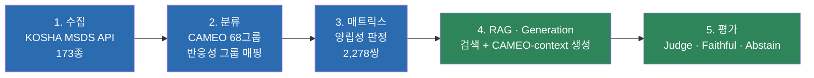

<div align="center">

# 🧪 MSDS 위험성평가 자동화

**화학물질들을 함께 두면 안전한가?** — KOSHA 공공데이터와 RAG로 답한다.

*포트폴리오 프로젝트 · 2026-07-29 ~ 진행중*

</div>

---

## 이 프로젝트가 푸는 문제

실험실·창고에서 화학물질 혼재보관 사고는 물질 하나의 위험성이 아니라
**"여러 물질을 같이 뒀을 때"** 일어난다. 그런데 이 상호작용 정보는 흩어져 있다 —
반응성 그룹 매트릭스(CAMEO)는 "위험/주의/안전" 딱지만 붙일 뿐 이유를 설명하지
않고, 정작 이유는 물질별 MSDS(물질안전보건자료) 원문 안에 텍스트로 묻혀 있다.

이 프로젝트는 KOSHA(한국산업안전보건공단) 공개 MSDS 데이터와 CAMEO 68개
반응성 그룹 체계를 결합해, **물질을 2종 이상 입력하면 왜 위험한지 원문 근거와
함께 답하는 시스템**을 만든다. 근거가 부족하면 억지로 답하지 않고 **기각
(Abstain)** 한다 — 안전 도메인에서는 "모르겠다"고 말하는 것도 기능이다.

### 서비스 범위 (2026-08-28 확정)

물질을 임의로 줄인 게 아니라, **근거를 제공할 수 있는 범위를 데이터로 결정**했다.

```
Registry 237종            CORE 5축 선정 기준을 통과한 후보
  ├─ Service 173종        KOSHA MSDS + CAMEO 매핑 모두 확보 -> 실제 검색·판정 대상
  └─ Unsupported 64종     KOSHA 미등재 39 / CAMEO 데이터 부재 25

Legacy corpus 89종        과거 평가 코퍼스에만 있던 물질. DB 보존, 서비스 제외
```

`service_eligible`은 사람이 켜는 플래그가 아니라 **Registry·KOSHA·CAMEO 상태에서
파생**된다(`substance_status` VIEW). 인덱스 생성 여부(`chunks_ready`)는 자격의
조건이 아니라 결과 검증이라 따로 둔다 — 청킹이 실패해도 "서비스 불가 물질"로
둔갑하지 않고 `index_status='인덱스 결손'`으로 드러난다.
상세: [`docs/REGISTRY.md`](docs/REGISTRY.md)

> **타협 불가 원칙**: 매트릭스(CAMEO) 판정을 단독 최종 답변 근거로 쓰지 않는다.
> 매트릭스는 "이미 결정된 판정값"으로 LLM에 주어지지만, LLM은 그 판정을 재판단하지
> 않고 실제 MSDS §2/§10 근거로 **설명**만 한다 — 판정과 설명의 근거를 분리해서,
> 설명이 근거를 벗어나면(hallucination) 그 자체로 실패로 잡는다. 착수일부터 한 번도
> 흔들리지 않은 규칙. 상세: [`archive/superseded_docs/decisions.md`](archive/superseded_docs/decisions.md) §0.3

---

## 아키텍처 — 5단계 파이프라인



5단계 전부 최소 1회 이상 전수 실행·측정 완료. 상세 흐름은 [`docs/PIPELINE.md`](docs/PIPELINE.md).

### 핵심 발견 — Retrieval이 아니라 Generation이 병목이었다

1차 라운드(baseline 프롬프트, LLM이 CAMEO 판정을 직접 재추론)에서 측정한 결과:
Retrieval hit rate **98.84%**(병목 아님)인데도 Generation 실패율이 압도적으로
높았다 — 근거가 있어도 회피(**over-abstention 46.1%**)하거나, 개별 물질의
위험문구를 쌍 반응성으로 오인해 과잉위험 판정(**30.9%**)하는 두 가지 실패
패턴이었다.

해법은 프롬프트를 다듬는 게 아니라 **역할을 바꾸는 것**이었다 — LLM에게 판정을
맡기지 않고, CAMEO 반응성 그룹 조회(이미 2,160건 전수에서 실제 정답과 **100%
일치** 검증됨)로 판정을 확정해 컨텍스트에 박아 넣은 뒤, LLM은 그 판정을 MSDS
근거로 **설명만** 하게 했다. 결과:

| 지표 | 1차(LLM이 직접 판정) | 최종(CAMEO-context) |
|---|---:|---:|
| 정답률 | 19.8% | **99.9%** |
| Over-abstention | 46.1% | 1.9% |
| Faithful(근거 밖 주장 없음) | 측정 안 됨 | **97.2%** |
| 물질 혼동 | 관측됨 | **0/2,142** |

전체 경위(prompt v2 시도 → 실패 → CAMEO-context 전환 → judge 채점버그 발견·수정 →
전수실행 429 재시도 강화 → 잔여 실패 표적 재시도)는 [`docs/GENERATION.md`](docs/GENERATION.md).

---

## 검색 계층 실측 결과

물질 쌍 2,160질의(평가 코퍼스 173종, 5개 질의 템플릿) 기준. 이 수치는 Registry 확장
(207→237)과 무관하다 — 평가 경로(`run_ab.py` / `freeze_retrieval.py`)는 `corpus_tag='173'`
을 그대로 쓰며 재측정하지 않았다.

| 지표 | 실측 |
|---|---:|
| Recall@10 | **0.9336** |
| Hit@10 | 0.9884 |
| MRR | 0.9169 |
| nDCG@10 | 0.8500 |
| 질의 임베딩 지연 | 368ms(목표 500ms 충족) |
| 검색 지연 | 6.3ms |

3종 이상 조합의 판정(매트릭스 조회)은 지원되지만, RAG 검색 자체의 실측 지표는
쌍(2종) 질의 기준까지만이다. 상세·실험 이력은 [`docs/RETRIEVAL.md`](docs/RETRIEVAL.md).

---

## N종(3종 이상) 물질 조합 지원

`src/compatibility_engine.py`의 `judge_combination_by_cas`가 입력 물질 전부를
쌍(pair)으로 쪼개 매트릭스 판정 후, worst-case 종합 + 전체 반응 매트릭스 표 +
쌍별 상세 리포트를 함께 낸다. 매트릭스 조회는 결정론적 DB 조회라 N종에 바로
적용되지만, 위 검색 계층 실측은 여전히 쌍 단위라는 점은 구분해서 표시한다.

---

## 이 프로젝트에서 보여주고 싶은 것

숫자보다 **판단 과정**을 더 신경 썼다 — 결정이 틀렸을 때 감추지 않고 왜
틀렸는지, 어떻게 다시 바꿨는지를 그대로 남겼다. 두 가지 사례:

> 검색 방식을 처음엔 "속도가 빠르다"는 이유로 dense 단독으로 정했다. 그런데
> 검색 범위를 좁히는 최적화를 하나 더 적용하고 나니 실측값이 **하이브리드가 7개
> 목표 중 6개, dense는 4개 충족**으로 뒤집혀, 결정 자체를 재전환했다.

> Generation 채점에서 "faithful 9.5% 실패"가 나왔을 때, 곧바로 프롬프트를 더
> 다듬는 대신 먼저 원인을 팠다 — 채점기(judge)가 CAMEO 컨텍스트를 못 보고
> MSDS 근거만 보고 채점하는 구조적 버그였다. 버그를 고치니 같은 13건 파일럿이
> 6/13 → 13/13 faithful로 뒤집혔다. **숫자가 나쁘게 나왔을 때 프롬프트부터
> 의심하지 않고 채점 로직부터 의심한 것**이 이 프로젝트 전체에서 반복되는 태도다.

이런 판단이 20건 넘게 쌓여 있고, 각각 "실측인지 사용자 결단인지", "출처가
있는지 없는지"를 구분해 기록했다.

| 문서 | 답하는 질문 |
|---|---|
| [`docs/PIPELINE.md`](docs/PIPELINE.md) | 전체 시스템은 어떻게 흘러가는가? |
| [`docs/REGISTRY.md`](docs/REGISTRY.md) | 어떤 물질을 다루는가? 넣고 빼는 기준은? |
| [`docs/DATA.md`](docs/DATA.md) | 데이터 원천은 무엇이고 어떻게 검증했는가? |
| [`docs/RETRIEVAL.md`](docs/RETRIEVAL.md) | 검색은 어떻게 설계했고 결과는 어땠는가? |
| [`docs/GENERATION.md`](docs/GENERATION.md) | 답변 생성과 평가를 어떻게 했는가? |
| [`docs/FILE_GUIDE.md`](docs/FILE_GUIDE.md) | 각 파일은 정확히 무엇을 하는가? |
| [`docs/HANDOFF.md`](docs/HANDOFF.md) | 현재 어디까지 왔는가? |
| [`docs/PROJECT_LOG.md`](docs/PROJECT_LOG.md) | 어떻게 발전했는가? |
| [`archive/`](archive/) | 폐기·기각 파일과 그 사유(분야별 정리, 원본 상세 문서 포함) |

---

## 기술 스택

| 영역 | 선택 | 비고 |
|---|---|---|
| 데이터 | KOSHA MSDS Open API, CAMEO 68그룹(PubChem 경로로 재검증) | 화학 도메인 원천 |
| 저장 | SQLite (`data/reactivity_reference.db`) | 관계형 진실원본 |
| 임베딩 | `dragonkue/BGE-m3-ko` | 한국어 특화, 사용자 지정 |
| 검색 | FAISS(dense) + BM25(kiwipiepy) + RRF 융합 + §10 boilerplate penalty | 하이브리드 |
| LLM | DeepSeek `deepseek-v4-flash`(thinking mode) | Generation + Judge 공용, OpenAI 호환 API |
| 평가 | 자체 rule+LLM Judge(faithful/predicted_verdict/substance_confused) | RAGAS는 파일럿 후 자체 채점기로 대체 |

---

## 디렉터리 구조

```
MSDS/
├─ README.md              # 이 문서
├─ docs/                  # 표준 문서 9종(위 표)
├─ src/                   # 재사용 핵심 모듈 (llm/retrieval/pipeline/eval_generation/
│                          # cameo_group_lookup/compatibility_engine)
├─ scripts/                # 실행 스크립트 (수집/분류/RAG 평가·생성 파이프라인)
├─ data/                  # DB·평가셋·청크·임베딩 캐시·원본 CSV
├─ results/               # 생성·채점 산출물(jsonl/json)
└─ archive/               # 폐기·기각 파일과 사유(NOTES.md 포함)
```

전체 파일 목록과 역할은 [`docs/FILE_GUIDE.md`](docs/FILE_GUIDE.md).

---

## 실행

```bash
# 1) .env에 DEEPSEEK_API_KEY 설정 후 연결 확인
python src/llm.py --check

# 2) Retrieval baseline 재현(캐시된 임베딩/인덱스 사용)
python scripts/run_ab.py embedding --models bge-m3-ko --granularity section --task pair --sections 2,10 --corpus-tag 173

# 3) Generation 파이프라인(CAMEO-context, 최종 채택본) 재현/이어서 실행
python scripts/run_cameo_full.py --workers 8

# 4) Demo UI (물질 선택 -> CAMEO 판정 -> MSDS 근거 검색 -> LLM 설명)
streamlit run app/streamlit_app.py
```

---

## 지금까지 완성된 것 / 아직인 것

**완성**
- [x] Substance Registry **CORE 237종 확정** — 5축 선정 기준, 서비스 대상 198종
      ([`docs/REGISTRY.md`](docs/REGISTRY.md))
- [x] **서비스 계약 A티어 173종** — CAMEO 매핑이 있는 서비스 대상 전량이 상세·검색·판정
      3조건을 모두 충족(2026-08-22, B1 티어 해소)
- [x] KOSHA MSDS §2/§3/§9/§10 상세 연동 — Registry 198종 전량 수집, 앱에서 물질별 조회
- [x] KOSHA MSDS 173종 평가 코퍼스(수집 자체는 더 넓은 풀에서 진행, 평가셋은 173종 확정)
- [x] CAMEO 68그룹 · 양립성 매트릭스 2,278쌍, PubChem 경로로 94% 재검증
- [x] RAG 검색 계층 — hybrid, Recall@10 0.9336 / Hit@10 0.9884
- [x] Generation 계층 — CAMEO-context 파이프라인, 정답률 99.9% / faithful 97.2%
- [x] N종(3종 이상) 물질 조합 판정(`judge_combination_by_cas`/`full_report`)
- [x] 자체 Judge 채점 파이프라인(rule + LLM, faithful/predicted_verdict/substance_confused)

**미완성 (감추지 않고 그대로 남김)**
- [ ] Reranker 미실행 — 저비용 대안(boilerplate penalty)으로 이미 목표 충족해 보류 중
- [ ] 잔여 faithful 실패 2.8%(61건) — 패턴은 파악됐으나(그룹 분류를 확인된 반응처럼
      단정) 완전히 해소되진 않음
- [ ] Registry 237종 중 **CAMEO 매핑 173종(73.0%)** — 2026-08-22에 PubChem `hid=86`으로
      142 → 173종으로 늘려 판정 가능 쌍은 51.3% → **76.3%**(14,878/19,503). 남은 25종은
      CAMEO에 데이터시트 자체가 없어(원소 23종 + 탄산나트륨 + 염화나트륨) **76.3%를 현재
      coverage로 확정**했다 — PubChem `hid=86`과 CAMEO 자체 색인 두 경로로 원천 부재 확인
- [ ] 원본 리스트 전체(173종 이전 풀) 안전성 재검증 미완
- [ ] RAGAS 기반 지표(Faithfulness/Context Precision 등)는 n=7 파일럿 이후 중단,
      자체 Judge로 대체된 채 재개 안 함(사유: [`archive/generation_experiments/NOTES.md`](archive/generation_experiments/NOTES.md))

솔직한 진행률이 실제로는 더 신뢰가 간다고 생각해서 완성된 척 하지 않는다.
상세 목록은 [`docs/HANDOFF.md`](docs/HANDOFF.md).

---

<div align="center">

*이 문서는 열람자를 위한 요약본이다.
실행 방법·환경변수·상세 설계 근거는 위 링크된 문서들을 참고.*

</div>
