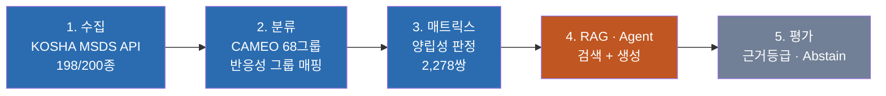
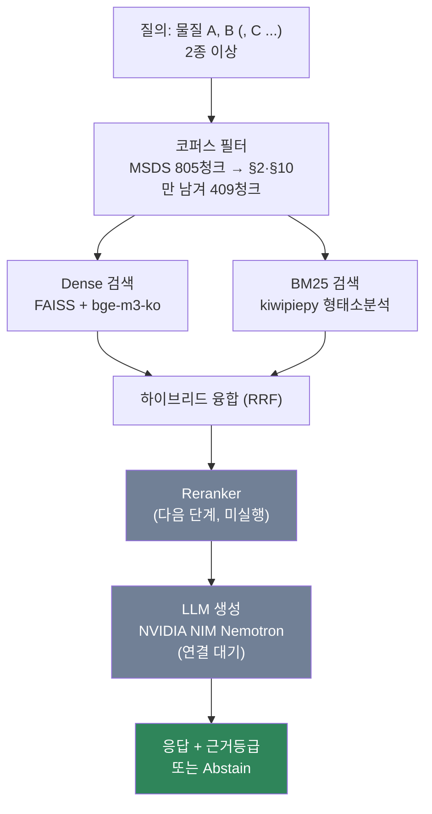

# 🧪 MSDS 위험성평가 자동화

**화학물질들을 함께 두면 안전한가?** — KOSHA 공공데이터와 RAG로 답한다.

*포트폴리오 프로젝트 · 2026-07-29 ~ 진행중*

---

## 이 프로젝트가 푸는 문제

실험실·창고에서 화학물질 혼재보관 사고는 물질 하나의 위험성이 아니라
**"여러 물질을 같이 뒀을 때"** 일어난다. 두 가지든, 세 가지든 마찬가지다. 그런데
이 상호작용 정보는 흩어져 있다 — 반응성 그룹 매트릭스는 "위험/주의/안전" 딱지만
붙일 뿐 이유를 설명하지 않고, 정작 이유는 물질별 MSDS(물질안전보건자료) 원문
안에 텍스트로 묻혀 있다.

이 프로젝트는 KOSHA(한국산업안전보건공단) 공개 MSDS 데이터 198종과 CAMEO
68개 반응성 그룹 체계를 결합해, **물질을 2종 이상 입력하면 왜 위험한지 원문
근거와 함께 답하는 시스템**을 만든다. 근거가 부족하면 억지로 답하지 않고 **기각
(Abstain)** 한다 — 안전 도메인에서는 "모르겠다"고 말하는 것도 기능이다.

> **스코프 정확히 말하기**: 물질 조합 판정(매트릭스 기반 결정론적 조회)은 **N종
> 지원** — 입력한 물질 전부를 쌍으로 쪼개 판정하고, 물질별 프로필 + 전체 반응
> 매트릭스 + 쌍별 유의사항을 한 리포트로 보여준다. 다만 **RAG 검색 계층의 실측
> 지표(Recall 등)는 여전히 쌍(2종) 질의 기준뿐**이다 — 결정론적 DB 조회와 RAG
> 검색 성능은 별개 층위라 구분해서 표시한다.

> 이 원칙("매트릭스 판정만으로 최종 답을 내지 않는다")은 프로젝트 착수일부터
> 지금까지 한 번도 흔들리지 않은 유일한 규칙이다. [`docs/decisions.md`](docs/decisions.md) §0.3

---

## 아키텍처 — 5단계 파이프라인

**현재 위치**: 4단계(RAG) 중 검색 계층까지 완주. 나머지는 [진행 상태](#지금까지-완성된-것--아직인-것) 참고.

### 4단계 내부 — 지금 가장 공들인 부분

회색으로 표시한 두 블록(Reranker, LLM 연결)이 아직 남은 부분이다 — 뒤에서 있는
그대로 밝힌다.

---

## 검색 계층 실측 결과

목표 스코프(2종 이상)의 최소 단위인 **물질 쌍 369건**(Incompatible 135 / Caution 114 /
Compatible 120)에 대해 실제로 측정한 값. 3종 이상 조합에서의 실측은 아직 없다.

| 지표 | 목표 | 실측 | 결과 |
|---|---:|---:|:--:|
| Recall@10 (핵심 지표) | ≥ 0.89 | **0.9005** | ✅ |
| MRR | ≥ 0.98 | 0.9986 | ✅ |
| nDCG@10 | ≥ 0.88 | 0.8932 | ✅ |
| Hit@5 (top-5 안에 정답 존재) | 1.00 | 1.0000 | ✅ |
| 검색 지연 | ≤ 10ms | 6.3ms | ✅ |
| 질의 임베딩 지연 | ≤ 500ms | 501.7ms | ❌ (1.7ms 초과) |

7개 목표 중 6개 충족. 유일한 미달은 검색 방식과 무관한 임베딩 모델 자체의
속도 문제(CPU 환경, 다음 단계에서 다룰 예정).

---

## 이 프로젝트에서 보여주고 싶은 것

숫자보다 **판단 과정**을 더 신경 썼다. 가장 잘 드러나는 사례 하나:

> 검색 방식을 처음엔 "속도가 빠르다"는 이유로 dense 단독으로 정했다. 그런데
> 같은 세션에서 검색 범위를 좁히는 최적화를 하나 더 적용하고 나니, 실측값이
> **하이브리드 방식이 7개 목표 중 6개, dense는 4개 충족**으로 뒤집혔다. 실측이
> 결정과 어긋난 그 순간을 감추지 않고 문서에 그대로 남겼고, 결국 그 기록을
> 근거로 **결정 자체를 다시 뒤집어 하이브리드로 재전환**했다.

이 과정 전체 — 최초 결정, 충돌 발견, 재검토, 번복 — 는 [`docs/decisions.md`](docs/decisions.md#24-검색-방식-hybrid-재채택-dense-단독-결정-철회)
에 순서대로 남아있다. 지운 게 아니라 이력으로 쌓았다.

이런 판단이 20건 넘게 쌓여 있고, 각각 **"실측인지 사용자 결단인지"**, **"출처가
있는지 없는지"**를 구분해 기록했다. 출처 없는 주장은 "출처: 없음"이라고 그대로
적었다 — 근거를 지어내지 않는 것도 이 문서의 원칙이다.

| 문서 | 내용 |
|---|---|
| [`docs/decisions.md`](docs/decisions.md) | 철학·기술 선택 23건, 근거 유형과 출처 |
| [`docs/PROJECT_LOG.md`](docs/PROJECT_LOG.md) | 착수일(07-29)부터 일자별 진행 기록 |
| [`docs/HANDOFF.md`](docs/HANDOFF.md) | 현재 상태 기준점(다음 작업 세션용) |
| [`archive/`](archive/) | 폐기·기각 파일과 그 사유(분야별 정리) |

---

## 기술 스택

| 영역 | 선택 | 비고 |
|---|---|---|
| 데이터 | KOSHA MSDS Open API, CAMEO 68그룹 | 화학 도메인 원천 |
| 저장 | SQLite | 관계형 진실원본 (개정이력·물질관리) |
| 임베딩 | `dragonkue/BGE-m3-ko` | 한국어 특화, 사용자 지정 |
| 검색 | FAISS(dense) + BM25(kiwipiepy) + RRF 융합 | 하이브리드 |
| LLM | NVIDIA NIM `nemotron-3-nano-omni-30b` | OpenAI 호환 API |
| 평가 | 자체 Retrieval 지표 드라이버, RAGAS(예정) | Recall/MRR/nDCG + Faithfulness 등 |

---

## 지금까지 완성된 것 / 아직인 것

**완성**
- [x] KOSHA MSDS 198/200종 수집 (2종은 근거 부족으로 의도적 미확보 — Abstain 정책의 실제 적용례)
- [x] CAMEO 68그룹 · 양립성 매트릭스 2,278쌍 구축
- [x] 근거등급제(법령>권고>참고) 자동 판정 규칙
- [x] RAG 검색 계층 (청킹·임베딩·하이브리드 검색) — **쌍(2종) 질의 기준**으로 위 실측 결과대로 동작 확인
- [x] **N종(3종 이상) 물질 조합 판정** — 입력 물질을 전부 쌍으로 쪼개 판정 후, 물질별
      프로필 + 전체 반응 매트릭스 + 쌍별 유의사항을 한 리포트로 (`compatibility_engine.py`
      `judge_combination_by_cas`/`full_report`). 상세 설계는 [`docs/decisions.md`](docs/decisions.md) §2.10

**미완성 (감추지 않고 그대로 남김)**
- [ ] **N종 물질 조합에서의 RAG 검색 실측** — 위 매트릭스 판정은 결정론적 DB
      조회라 N종 지원되지만, RAG 검색 계층 Recall/MRR 실측은 여전히 쌍(2종) 질의
      기준뿐. 셋 이상을 한 질의로 넣었을 때 검색 품질은 측정된 적 없음
- [ ] LLM 연결 — API 키 설정 대기, 그래서 아직 실제 "질문 → 답변"을 보여줄 수 없음
- [ ] Reranker 실행 — 코드는 있으나 미실행
- [ ] RAG 품질 지표(Faithfulness 등) — LLM 연결 후 측정 가능
- [ ] 원본 200종 리스트 안전성 재검증 — 대체품 32종만 재검증됐고 원본 전체는 아직

솔직한 진행률이 실제로는 더 신뢰가 간다고 생각해서 완성된 척 하지 않는다.
상세 목록은 [`docs/HANDOFF.md`](docs/HANDOFF.md) §4.

---

*이 문서는 열람자를 위한 요약본이다. 
실행 방법·환경변수·상세 설계 근거는 위 링크된 문서들을 참고.*

