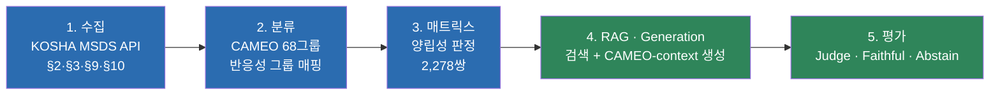

<div align="center">

# 🧪 MSDS 위험성평가 자동화

**화학물질들을 함께 두면 안전한가?** — KOSHA 공공데이터와 RAG로 답한다.

*포트폴리오 프로젝트 · 2026-07-29 ~ 진행중*

</div>

---

## 프로젝트 목적과 서비스

실험실·창고에서 화학물질 혼재보관 사고는 물질 하나의 위험성이 아니라
**"여러 물질을 같이 뒀을 때"** 일어난다. 그런데 이 상호작용 정보는 흩어져 있다 —
반응성 그룹 매트릭스(CAMEO)는 "위험/주의/안전" 딱지만 붙일 뿐 이유를 설명하지
않고, 정작 이유는 물질별 MSDS(물질안전보건자료) 원문 안에 텍스트로 묻혀 있다.

이 프로젝트는 KOSHA(한국산업안전보건공단) 공개 MSDS 데이터와 CAMEO 68개
반응성 그룹 체계를 결합해, **물질을 2종 이상 입력하면 왜 위험한지 원문 근거와
함께 답하는 시스템**을 만든다. 근거가 부족하면 억지로 답하지 않고 **기각
(Abstain)** 한다 — 안전 도메인에서는 "모르겠다"고 말하는 것도 기능이다.

### 서비스 범위

물질을 임의로 줄인 게 아니라, **근거를 제공할 수 있는 범위를 데이터로 결정**했다.

```
Registry 237종        CORE 5축 선정 기준을 통과해 등록한 물질
  ├─ 선택 가능 198종   KOSHA MSDS 등재 -> 앱 목록에 뜨고 상세정보를 준다
  │    ├─ 판정 가능 173종   CAMEO 매핑까지 있음 -> 조합 판정 + 설명 생성
  │    └─ 판정 보류  25종   CAMEO에 데이터시트 자체가 없음 -> 조합은 Abstain
  └─ 선택 불가  39종   KOSHA 미등재(전부 원소). 상세정보를 줄 수 없어 목록에서 제외
```

**"판정 보류 25종"도 고를 수는 있다.** 고르면 상세정보는 나오고 조합 판정만 Abstain으로
나간다 — 없는 근거를 지어내는 것보다 모른다고 말하는 게 맞기 때문이다.

"서비스 대상인가"는 사람이 켜고 끄는 값이 아니라 Registry·KOSHA·CAMEO 세 축의
상태에서 자동으로 계산된다(`substance_status` VIEW). 검색 인덱스가 만들어졌는지는
자격 조건이 아니라 결과를 확인하는 값이라 따로 둔다 — 청킹이 실패해도 그 물질이
"서비스 불가"로 둔갑하지 않고 `index_status='인덱스 결손'`으로 드러난다.
상세: [`docs/REGISTRY.md`](docs/REGISTRY.md)

> **타협 불가 원칙**: 매트릭스(CAMEO) 판정을 단독 최종 답변 근거로 쓰지 않는다.
> 매트릭스는 "이미 결정된 판정값"으로 LLM에 주어지지만, LLM은 그 판정을 재판단하지
> 않고 실제 MSDS §2/§10 근거로 **설명**만 한다 — 판정과 설명의 근거를 분리해서,
> 설명이 근거를 벗어나면(hallucination) 그 자체로 실패로 잡는다. 착수일부터 한 번도
> 흔들리지 않은 규칙. 상세: [`archive/superseded_docs/decisions.md`](archive/superseded_docs/decisions.md) §0.3

---

## 아키텍처 — 5단계 파이프라인



5단계 전부 최소 1회 이상 전수 실행·측정 완료. 상세 흐름은 [`docs/PIPELINE.md`](docs/PIPELINE.md).

### 핵심 설계 — LLM에게 판정을 시키지 않는다

CAMEO 반응성 그룹 조회는 이미 전수에서 실제 정답과 **100% 일치**함이 확인돼 있다. 이미
믿을 수 있는 판정이 있는데 LLM에게 다시 추론하게 할 이유가 없다. 그래서 역할을 나눴다.

- **판정은 CAMEO가** — 결정론적 DB 조회. 프롬프트에 "이미 결정된 값"으로 들어간다
- **설명은 LLM이** — 그 판정을 재판단하지 않고 MSDS §2/§10 원문으로 왜 그런지만 말한다
- **판정줄과 결론 문장은 코드가** — 모델이 아예 쓰지 않는다. 복사조차 시키지 않는 이유는
  복사를 틀릴 기회를 주기 때문이다(실제로 시켰더니 1.04%가 뒤집혔고 대부분 위험을 낮추는
  방향이었다)

현행 프롬프트는 둘이고 조건이 같다 — `corpus_tag='service'` 173종, 근거는 두 CAS의
§2·§10 직접조회, 쌍 질의 2,240건 전수, 생성·채점 실패 0건.

| 지표 | v7 (자유텍스트, 앱이 쓰는 경로) | v8b (structured output) |
|---|---:|---:|
| 정답률(판정줄) | 99.9% | 100.0% |
| **정답률(judge 재분류)** | **94.0%** | **92.9%** |
| Faithful(근거 밖 주장 없음) | 97.5% | 92.9% |
| 물질 혼동 | 0.0% | 0.0% |
| 판정줄–본문 일치 | 93.4% | 92.0% |
| 생성 지연(평균) | 13.3초 | 4.2초 |

> **판정줄 기준 수치와 물질혼동 0%는 성과가 아니라 구조가 보장하는 값이다.** 판정은 코드가
> 넣고, 근거는 두 물질의 것만 조회하므로 제3물질이 들어올 경로가 없다. 실제 품질을 재는
> 건 judge가 **본문**을 다시 분류한 값이고, 그 격차가 남은 결함이다
> ([`docs/GENERATION.md`](docs/GENERATION.md) 4절).

LLM이 판정까지 직접 하던 초기 구조는 폐기했다. 그 구조가 왜 실패했는지는
[`docs/PROJECT_LOG.md`](docs/PROJECT_LOG.md)에 기록돼 있다.

---

## 검색 계층 실측 결과

서비스 코퍼스(`corpus_tag='service'`, 173종 / 371청크) 기준. 물질 쌍 450쌍 × 5개 질의
템플릿 = 2,250질의 중 gold_evidence가 없는 10건을 제외한 2,240질의.

| 지표 | 쌍 질의 | **질의 분해** |
|---|---:|---:|
| Recall@10 | 0.8987 | **0.9888** |
| Hit@10 | 0.9790 | **1.0000** |
| MRR | 0.8803 | **0.9581** |
| nDCG@10 | 0.8065 | **0.9547** |
| 질의 임베딩 지연 | 444ms | 461ms(목표 500ms 충족) |
| 검색 지연 | 4.9ms | 11.2ms |

채점은 **근거(evidence) 기준**이다 — 정답으로 인정하는 것은 §2 GHS 분류 청크뿐이다.
§10은 여러 물질에 똑같이 반복되는 정형 문구라, 같은 문서의 무관한 청크가 검색됐다고
성공으로 세지 않는다. 섹션 단위로 채점한 수치와는 정의가 달라 직접 비교할 수 없다.

> 지금 서비스는 사용자가 목록에서 물질을 고르므로 CAS가 이미 정해져 있다. 그래서 검색
> 대신 MSDS를 직접 조회한다. 검색 계층은 자유 문장 질의와 근거 확장을 위해 그대로 둔다.
>
> 위 수치는 **검색 계층**의 실측이다. **서비스 경로**는 두 CAS의 §2·§10을 SQL로 직접
> 조회한다 — 정답 확보 100%, 제3물질 0%, 프롬프트 8,570자 → 3,170자, 질의 임베딩
> 461ms → 0ms. 나눈 이유는 아래 "검색을 안 쓰기로 한 이유".

```
검색 계층 (평가·확장)                       서비스 경로 (production)
  src/retrieval.py                            app/streamlit_app.py
  scripts/4_retrieval/run_ab.py                 explain(CAS_A, CAS_B)
  scripts/4_retrieval/freeze_retrieval.py         └─ pair_context()  CAS 직접조회 §2+§10
  app/streamlit_app.py: retrieve(query)
```

### 실패를 먼저 세어보고 고쳤다

Hit@10이 0.979로 높은데도 **두 물질의 근거를 모두 확보한 비율은 67.9%**였다. Hit은
"둘 중 하나만 찾아도" 성공으로 세기 때문에 높게 보였던 것이다. 실패 사례를 50위까지
들여다보니 가장 흔한 유형이 **"한쪽 물질의 §2만 찾음"(22.4%)**이었고, 놓친 근거의 81%는
11~20위에 있었다 — 못 찾은 게 아니라 순위에서 밀린 것이다.

원인은 쌍 질의였다. 벡터 하나로 두 물질을 동시에 겨냥하니 한쪽이 밀린다. 물질명 단독으로
물으면 171종 중 162종이 자기 §2를 1위로 가져온다. 그래서 쌍 질의를 **물질별 질의 2개로
분해해 각 top-5씩 교차 병합**했다 — 검색 예산은 그대로다. 리랭커 실행은 안했다:
분해만으로 Hit@10이 1.000이 돼 얹을 이유가 없어졌다.

### 검색을 안 쓰기로 한 이유

질의를 나눠 순위 문제는 잡혔는데 **한 가지가 안 풀렸다.** LLM에게 주는 근거의 60%가
그 쌍과 상관없는 제3의 물질 것이었고(나누기 전 65.8%), 이게 답변에서 남의 물질을
근거로 인용하는 문제의 원인이다. 코퍼스가 173종 371청크라 **물질 하나당 청크가 2.1개**
뿐이어서, 한 물질에 대해 2개 넘게 가져오라고 하면 나머지는 남의 물질일 수밖에 없는
구조였다.

그래서 물질당 개수를 줄여 가며 다시 재 봤더니, **검색을 아예 안 하는 쪽이 모든 항목에서
이겼다.**

| 방식 | 청크 | 정답확보 | 제3물질 | 프롬프트 | 질의 임베딩 |
|---|---:|---:|---:|---:|---:|
| 분해 top-5/측 | 9.62 | 0.9888 | 60.1% | 8,570자 | 461ms |
| 분해 top-3/측 | 5.93 | 0.9821 | 44.5% | 5,326자 | 461ms |
| **CAS 직접조회 §2+§10** | **4.29** | **1.0000** | **0.0%** | **3,170자** | **0ms** |

이길 수밖에 없다. 정답 근거는 정의상 두 물질의 §2이고, 앱은 두 물질의 CAS를 **이미
알고 있다** — 사용자가 목록에서 고른 값이다. 검색은 이미 확실히 아는 것을 다시 찾고
있었고, 그 과정에서 남의 물질을 섞어 넣고 있었다. 여기서 검색은 정보를 더해 주지
않고 잃기만 한다.

**검색 계층을 지우지는 않았다.** 지표는 그대로 유효하고, 자유 문장으로 묻거나 물질당
청크가 늘어나면 다시 필요해진다. 다만 **지금 앱이 그 경로를 쓰지 않는다는 사실을 숫자와
함께 적는다** — 이걸 빼면 검색 성능이 곧 제품 성능인 것처럼 읽힌다.

3종 이상 조합의 판정(매트릭스 조회)은 지원되지만, RAG 검색 자체의 실측 지표는
쌍(2종) 질의 기준까지만이다. 상세·실험 이력은 [`docs/RETRIEVAL.md`](docs/RETRIEVAL.md).

---

## N종(3종 이상) 물질 조합 지원

`src/compatibility_engine.py`의 `judge_combination_by_cas`가 입력 물질 전부를
쌍(pair)으로 쪼개 매트릭스 판정 후, worst-case 종합 + 전체 반응 매트릭스 표 +
쌍별 상세 리포트를 함께 낸다. 매트릭스 조회는 결정론적 DB 조회라 N종에 바로
적용되지만, 위 검색 계층 실측은 여전히 쌍 단위라는 점은 구분해서 표시한다.

---

## 이 프로젝트에서 보여주고 싶은 것

숫자보다 **판단 과정**을 더 신경 썼다 — 
두 가지 사례:

아래 두 사례는 **개발 과정의 기록**이며, 현재 구성은 위 절들이 정본이다(전체 경위는
[`docs/PROJECT_LOG.md`](docs/PROJECT_LOG.md)).

> 검색 방식을 처음엔 "속도가 빠르다"는 이유로 dense 단독으로 정했다. 그런데
> 검색 범위를 좁히는 최적화를 하나 더 적용하고 나니 실측값이 **하이브리드가 7개
> 목표 중 6개, dense는 4개 충족**으로 뒤집혀, 하이브리드로 재결정했다.

> Generation 채점에서 "faithful 9.5% 실패"가 나왔을 때, 곧바로 프롬프트를 더
> 다듬는 대신 먼저 원인을 진단했다. — 채점기(judge)가 CAMEO 컨텍스트를 못 보고
> MSDS 근거만 보고 채점하는 구조적 버그였다. 버그를 고치니 같은 13건 파일럿이
> 6/13 → 13/13 faithful로 뒤집혔다. **숫자가 나쁘게 나왔을 때 프롬프트부터
> 의심하지 않고 채점 로직부터 의심한 것**이 이 프로젝트 전체에서 반복되는 향상이다.

>결론 : 문제에 몰두하기보다 발생한 원인을 진단하고 문제 발생 원인을 차단시키는 방향으로
진행해왔다.
이런 판단이 20건 넘게 쌓여 있고, 각각 "실측인지 사용자 결단인지", "출처가
있는지 없는지"를 구분해 기록했다.

| 문서 | 답하는 질문 |
|---|---|
| [`docs/PIPELINE.md`](docs/PIPELINE.md) | 전체 시스템은 어떻게 흘러가는가? |
| [`docs/REGISTRY.md`](docs/REGISTRY.md) | 어떤 물질을 다루는가? 넣고 빼는 기준은? |
| [`docs/DATA.md`](docs/DATA.md) | 무슨 데이터를 쓰고 왜 그걸 쓰는가? |
| [`docs/RETRIEVAL.md`](docs/RETRIEVAL.md) | 검색 계층은 어떻게 구성돼 있고 성능은 얼마인가? |
| [`docs/GENERATION.md`](docs/GENERATION.md) | 설명을 어떻게 만들고 어떻게 채점하는가? |
| [`docs/FILE_GUIDE.md`](docs/FILE_GUIDE.md) | 각 파일은 정확히 무엇을 하는가? |
| [`docs/HANDOFF.md`](docs/HANDOFF.md) | 지금 상태 그대로 이어받으려면? |
| [`docs/PROJECT_LOG.md`](docs/PROJECT_LOG.md) | 어떻게 발전했는가? |
| [`archive/`](archive/) | 폐기·기각 파일과 그 사유(분야별 정리, 원본 상세 문서 포함) |

---

## 기술 스택

| 영역 | 선택 | 비고 |
|---|---|---|
| 데이터 | KOSHA MSDS Open API, CAMEO 68그룹(CAS → PubChem CID → CAMEO 분류) | 화학 도메인 원천 |
| 저장 | SQLite (`data/reactivity_reference.db`) | 관계형 진실원본 |
| 임베딩 | `dragonkue/BGE-m3-ko` | 한국어 특화, 사용자 지정 |
| 검색 | FAISS(dense) + BM25(kiwipiepy) + RRF 융합 + §10 boilerplate penalty | 하이브리드 |
| LLM | Upstage `solar-pro3`(reasoning_effort=high) | Generation + Judge 공용, OpenAI 호환 API |
| 평가 | 자체 rule+LLM Judge(faithful/predicted_verdict/substance_confused) | RAGAS는 파일럿 후 자체 채점기로 대체 |

---

## 디렉터리 구조

```
MSDS/
├─ README.md              # 이 문서
├─ docs/                  # 표준 문서 9종(위 표)
├─ src/                   # 재사용 핵심 모듈 (llm/retrieval/pipeline/eval_generation/
│                          # cameo_group_lookup/compatibility_engine)
├─ scripts/               # 실행 스크립트 24종 — 파이프라인 순서대로 폴더가 나뉜다
│   ├─ 1_collect/         #   KOSHA MSDS 수집
│   ├─ 2_registry/        #   물질 선정 · CAMEO 매핑 · 서비스 계약 감사
│   ├─ 3_corpus/          #   DB 시드 · 코퍼스 정의 · 임베딩 인덱스
│   ├─ 4_retrieval/       #   평가셋 · 검색 평가 · 입력 고정
│   ├─ 5_generation/      #   프롬프트 정의 · 전수 생성
│   └─ 6_eval/            #   채점 · 요약 · 리포트
├─ tests/                 # 자가검증 4종 (pipeline/collector/evalset/run_cameo 재개)
├─ app/                   # Streamlit 조회·판정 UI
├─ data/                  # DB·평가셋·선정 기준 CSV (+ 미추적 캐시 chunks/ index/)
├─ results/               # 최종 결과만 12개 — 무엇이 어느 수치의 근거인지는 results/README.md
└─ archive/               # 대체·폐기된 파일과 사유(폴더마다 NOTES.md)
```

전체 파일 목록과 역할은 [`docs/FILE_GUIDE.md`](docs/FILE_GUIDE.md),
결과 파일과 지표의 대응은 [`results/README.md`](results/README.md).

---

## 실행

```bash
# 1) .env에 UPSTAGE_API_KEY 설정 후 연결 확인
python src/llm.py --check

# 2) 앱 실행 (물질 선택 -> CAMEO 판정 -> MSDS 근거 직접조회 -> LLM 설명)
streamlit run app/streamlit_app.py

# 2-b) LLM 없이 앱 경로 자가검증
python app/streamlit_app.py --check
```

지표를 다시 내려면:

```bash
# Retrieval 확정 지표 (캐시된 임베딩/인덱스 사용, --decompose 가 확정 구성이다)
python scripts/4_retrieval/run_ab.py embedding --models bge-m3-ko --granularity section --task pair --sections 2,10 --corpus-tag service --decompose

# Generation 전수 (근거는 CAS 직접조회, structured output)
#   worker 수는 Upstage 레이트리밋(100 RPM / 250,000 TPM)에 맞춘 값이다.
#   채점은 호출당 5.3k 토큰 x 1.3초라 worker 1개가 이미 TPM 상한이다.
python scripts/5_generation/run_cameo_full.py --context pair --format schema --tag v8b --stage gen  --workers 7
python scripts/5_generation/run_cameo_full.py --context pair --format schema --tag v8b --stage eval --workers 1
python scripts/6_eval/summarize_cameo_full.py --gen results/generation_cameo_full_pair_v8b.jsonl --eval results/eval_cameo_full_pair_v8b.jsonl
```

앱이 쓰는 자유 텍스트 경로(v7)로 재실행하려면 `--format text --tag v7`로 바꾼다.
어떤 수치가 어느 파일에서 나오는지는 [`results/README.md`](results/README.md)가 단일 출처다.

---

## 지금까지 완성된 것 / 아직인 것

**완성**
- [x] Substance Registry **CORE 237종** — 5축 선정 기준, 선택 가능 198종, 판정 가능 173종
      ([`docs/REGISTRY.md`](docs/REGISTRY.md))
- [x] KOSHA MSDS §2/§3/§9/§10 연동 — 선택 가능 198종 전량 확보, 앱에서 물질별 조회
- [x] CAMEO 68그룹 · 양립성 매트릭스 2,278쌍
- [x] RAG 검색 계층 — hybrid + 질의 분해, Recall@10 **0.9888** / Hit@10 **1.0000**
      (service 코퍼스 173종, 2,240질의, evidence 기준)
- [x] Generation 계층 — CAMEO 판정 + MSDS 근거 설명, 정답률(judge 재분류) **94.0%**(v7) /
      **92.9%**(v8b), faithful 97.5% / 92.9% (2,240건 전수, 실패 0건)
- [x] N종(3종 이상) 물질 조합 판정(`judge_combination_by_cas`/`full_report`)
- [x] 자체 Judge 채점 파이프라인(rule + LLM, faithful/predicted_verdict/substance_confused)

**미완성 (감추지 않고 그대로 남김)**
- [ ] **Caution 칸의 본문 서술 (최대 결함)** — 판정줄은 항상 맞지만 본문 강도가 어긋난다.
      v7은 Caution 745건 중 84건을 더 위험하게, v8b는 70건을 덜 위험하게 읽는다. 안전
      관점에서 문제가 되는 건 덜 위험하게 읽는 쪽이다(위험한 조합을 Compatible로 읽은
      건수 v7 36 / v8b 84). 이 칸을 겨냥한 개정안(v9)은 채택 기준 미달로 폐기했다
- [ ] 잔여 faithful 실패 — 그룹 분류를 확인된 반응처럼 단정하는 패턴
- [ ] **CAMEO 매핑 173/237** — 판정 가능 쌍 **76.3%**(14,878/19,503). 남은 25종은
      CAMEO에 데이터시트 자체가 없어(원소 23종 + 탄산나트륨 + 염화나트륨) 76.3%를 현재
      coverage로 **확정**했다. PubChem `hid=86`과 CAMEO 자체 색인 두 경로로 원천 부재를
      확인했고, 목표는 100%가 아니다
- [ ] 3종 이상 조합의 **검색 실측** 없음 — 판정은 되지만 검색 지표는 쌍 단위까지다
- [ ] Reranker 미실행 — 질의 분해만으로 Hit@10 1.0000이 돼 보류
- [ ] 원본 리스트 전체의 안전성 재검증 미완
- [ ] RAGAS 기반 지표는 파일럿 후 중단, 자체 Judge로 대체된 채 재개 안 함
      (사유: [`archive/generation_experiments/NOTES.md`](archive/generation_experiments/NOTES.md))

상세는 [`docs/HANDOFF.md`](docs/HANDOFF.md).

---

<div align="center">

*이 문서는 열람자를 위한 요약본이다.
실행 방법·환경변수·상세 설계 근거는 위 링크된 문서들을 참고.*

</div>
