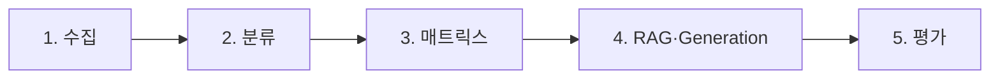
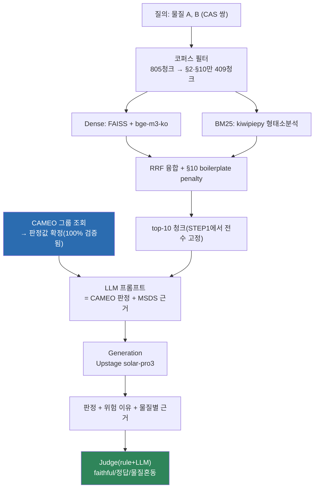

# PIPELINE — 전체 시스템은 어떻게 흘러가는가?

## 5단계 개요

| # | 단계 | 산출물 | 코드 |
|---|---|---|---|
| 0 | 다룰 물질 확정(CORE 5축) | `substance_registry`(237종) | `scripts/2_registry/build_substance_registry.py`, [`REGISTRY.md`](REGISTRY.md) |
| 1 | KOSHA MSDS Open API로 물질별 §2/§3/§9/§10 4개 핵심 섹션 수집 | `data/reactivity_reference.db`의 `msds_sections`, `msds_chem_id_cache` | `scripts/1_collect/kosha_msds_collector.py` |
| 2 | CAS → CAMEO 68개 반응성 그룹 매핑 | `chemicals`, `chemical_group_membership` | `scripts/2_registry/build_chemical_group_membership.py`, `archive/2026-08-08_selection_scripts/group_fallback.py` |
| 3 | 68×68 그룹 양립성 매트릭스 구축 | `compatibility_pairs`(2,278쌍), `self_reactivity` | `scripts/3_corpus/seed_reactivity_reference.py`, `scripts/3_corpus/seed_self_reactivity.py` |
| 4 | 청킹→임베딩→검색→CAMEO-context 생성 | `data/chunks`, `data/index`, `archive/2026-08-29_generation_prompt_history/v6/generation_cameo_full.jsonl` | `src/pipeline.py`, `src/retrieval.py`, `scripts/5_generation/run_cameo_full.py` |
| 5 | Judge 채점(faithful/정답/abstain) | `archive/2026-08-29_generation_prompt_history/v6/eval_cameo_full.jsonl` | `src/eval_generation.py` |

단계별 상세 설계·실측은 [`REGISTRY.md`](REGISTRY.md)(0단계),
[`DATA.md`](DATA.md)(1~2단계), [`RETRIEVAL.md`](RETRIEVAL.md)(4단계 검색),
[`GENERATION.md`](GENERATION.md)(4단계 생성 + 5단계)를 본다. 이 문서는 단계 사이의
**연결**과 최종 확정 구성만 다룬다.

0단계가 1~5단계를 모두 게이트한다 — Registry에 없으면 수집도 판정도 시작되지 않고,
Registry에 있어도 KOSHA 미등재(39종)면 서비스 대상에서 빠진다. 물질별로 어느 단계까지
실제로 도달했는지는 [`REGISTRY.md`](REGISTRY.md#6-서비스-계약--등록됐다고-다-서비스되는-게-아니다)의
계약 티어 표로 확인한다.

---

## 4단계 내부 — 질의 하나가 통과하는 경로

**핵심 설계 결정**: 판정(Compatible/Caution/Incompatible)은 검색·생성 어느 쪽도
내리지 않는다. CAMEO 그룹 조회가 이미 정답을 확정하고(전수 검증 100% 일치),
검색+생성은 "왜 그런지" MSDS 원문 근거로 설명하는 역할만 맡는다. 이렇게 나눈
이유는 [`GENERATION.md`](GENERATION.md#핵심-전환-cameo-context-주입)에 있다 — 원래는
LLM이 판정까지 직접 추론하는 구조였고, 그게 최대 실패 원인이었다.

---

## 확정 구성 (변경 없는 한 이게 기준)

| 항목 | 확정값 | 근거 |
|---|---|---|
| 임베딩 | `dragonkue/BGE-m3-ko` | 사용자 지정(A/B 승자 아님) |
| 청킹 | section 단위 단독(item 폐기) | 실측 + 구조적 논증 |
| 검색 공간 | §2·§10 필터(805→409청크) | 실측 — 정확도·속도 동시 개선 |
| 검색 | Hybrid(dense+BM25, RRF k=60) + §10 penalty(λ=0.01) | 실측, [`RETRIEVAL.md`](RETRIEVAL.md) |
| 리랭커 | `bge-reranker-base` 예정, **미실행** | 저비용 대안(penalty)으로 이미 목표 충족, 보류 |
| Generation/Judge LLM | Upstage `solar-pro3`(reasoning_effort=high) | 사용자 지정, 동일 모델을 판정 설명·채점 양쪽에 재사용. 2026-08-29 전환 — 그 이전 173 코퍼스 지표는 NVIDIA NIM Nemotron 으로 냈다 |
| 판정 소스 | CAMEO 반응성 그룹 조회(결정론적 DB) | LLM 재판단 금지 — 타협 불가 원칙 |
| N종(3종+) 조합 | `judge_combination_by_cas`가 전체 쌍 C(N,2)을 계산 후 worst-case 종합 | 매트릭스 조회는 N종 지원, RAG 검색 실측은 쌍 단위까지만 |
| 서비스 물질 | Registry 237종 중 KOSHA 등재 198종 | 선정 기준은 Registry 단독, [`REGISTRY.md`](REGISTRY.md) |
| 검색 인덱스 멤버십 | `corpus_tag in ('173','core')` = 262종 / §2·§10 557청크 | `173`은 평가 재현용 고정, Registry 편입분은 `core`에 등록 |
| 질의문 | registry 표준명 + 별칭 최대 3개(`query_term()`) | 청크 헤더가 KOSHA 원문명이라 표준명만으론 BM25 매칭 실패 |

## 설계가 실제로 바뀐 지점들 (계획 vs 실행)

최초 설계(`archive/superseded_docs/stage4_design_principles_v2.md`)는 임베딩
3파전(bge-m3/bge-m3-ko/KURE) A/B, 리랭커 A/B, dense 단독 우선을 계획했다. 실제로는:

1. **임베딩은 사용자가 `bge-m3-ko`로 바로 지정** — A/B 승자가 아니라 지정값. 3파전은
   실행 안 됨.
2. **dense 단독 → hybrid로 재전환** — §2·§10 필터 적용 후 재실측하니 hybrid가 7개
   목표 중 6개 충족(dense는 4개), 레이턴시 차이가 예산 안에 들어와 재채택.
   ([`archive/superseded_docs/decisions.md`](../archive/superseded_docs/decisions.md) §2.4)
3. **리랭커는 여전히 미실행** — boilerplate penalty(§10 정형문구 감점)만으로 Evidence
   MRR이 0.516→0.835(+62%)까지 개선돼, 무거운 모델을 새로 들일 이유가 없었다.
4. **Generation 단계 자체가 통째로 재설계됨** — 최초 계획은 "검색→LLM이 직접 판정"
   구조였다. 1차 실측(over-abstention 46.1%)을 본 뒤 "CAMEO가 판정, LLM은 설명만"
   구조로 전환한 게 이 프로젝트에서 가장 큰 설계 변경이다.

설계변경 12건의 전체 기록: [`archive/superseded_docs/stage4_design_changes_2026-08-06.md`](../archive/superseded_docs/stage4_design_changes_2026-08-06.md).

## 타협 불가 원칙 (5단계 전체에 적용)

1. 양립성 매트릭스 조회 결과를 단독 최종 판정 근거로 사용 금지
2. CAMEO 최신 68그룹 체계 엄격 적용(구 EPA 41그룹 폐기)
3. 근거 부족 시 Abstain — 억지로 답변하지 않음
4. 근거 등급제: 법령(Mandatory) > 권고(Recommended) > 참고(Reference)
5. 서비스키·API키 원문은 코드/로그/응답 어디에도 노출 금지
