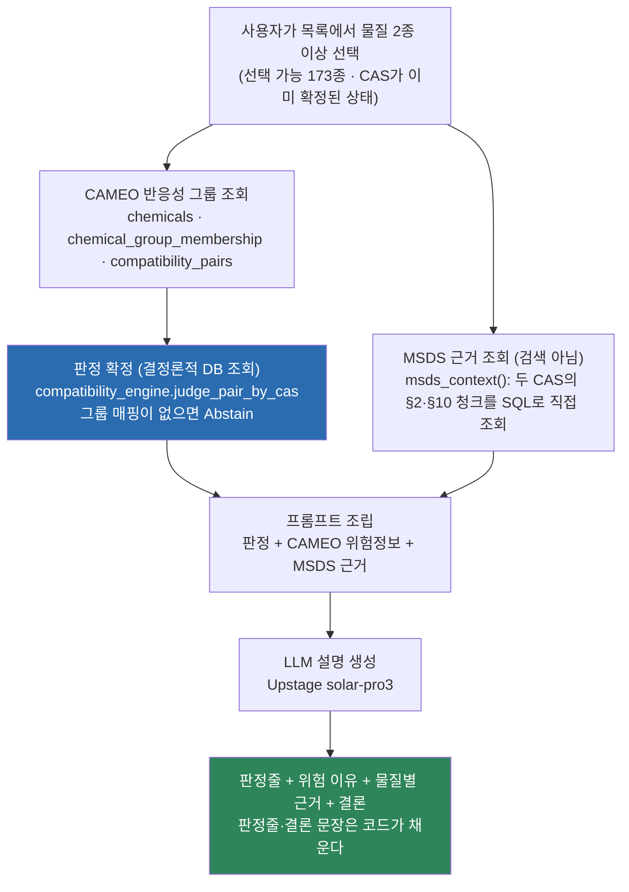
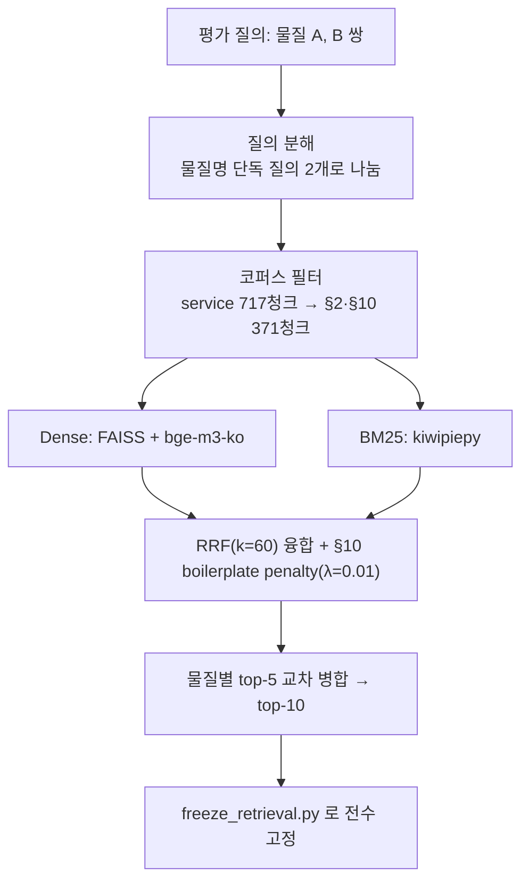

# PIPELINE — 전체 시스템은 어떻게 흘러가는가?

이 저장소에는 **역할이 다른 두 경로**가 있다. 섞어 읽으면 안 된다.

| | 서비스 실행 경로 | 구축·평가 경로 |
|---|---|---|
| 무엇 | 사용자가 물질을 고르면 판정과 설명을 낸다 | 데이터를 모아 DB를 만들고, 검색·생성 성능을 측정한다 |
| 진입점 | `app/streamlit_app.py` | `scripts/1_collect` ~ `scripts/6_eval` |
| 검색 사용 | **안 한다**(CAS를 이미 알고 있어서) | 한다(검색 계층 자체를 측정하는 게 목적) |
| 정본 문서 | 이 문서 아래 1절 | 이 문서 아래 2절 |

---

## 1. 서비스 실행 경로 — 사용자가 물질을 고른 뒤 벌어지는 일

**판정은 LLM이 내리지 않는다.** CAMEO 그룹 조회가 판정을 확정하고, LLM은 그 판정을
재추론하지 않고 MSDS §2·§10 원문으로 **왜 그런지만 설명**한다. 판정줄과 결론 문장은
아예 모델이 쓰지 않고 코드가 조립한다(`render_answer` / `render_conclusion`).
근거를 붙일 수 없으면 Abstain한다. 이 분리의 근거와 측정치는
[`GENERATION.md`](GENERATION.md).

**근거를 검색으로 찾지 않는 이유.** 서비스 질의는 사용자가 목록에서 고른 것이라
CAS가 이미 정해져 있다(closed-world). 정답 근거는 정의상 그 두 물질의 §2이므로,
검색은 이미 확실히 아는 것을 다시 찾으면서 다른 물질의 청크를 섞어 넣기만 한다.
실측 비교는 [`RETRIEVAL.md`](RETRIEVAL.md).

| 단계 | 코드 | 읽는 테이블 |
|---|---|---|
| 선택 목록 구성 | `app/streamlit_app.py` (registry − KOSHA 미등재) | `substance_registry`, `msds_chem_id_cache` |
| 판정 | `src/compatibility_engine.py` `judge_pair_by_cas` / `judge_combination_by_cas` | `chemicals`, `chemical_group_membership`, `compatibility_pairs`, `self_reactivity` |
| CAMEO 위험정보 한글화 | `src/cameo_group_lookup.py`, `src/kr_glossary.py` | `compatibility_hazard_codes`, `compatibility_gas_products`, 레전드 2종 |
| MSDS 근거 | `app/streamlit_app.py` `msds_context()` / `pair_context()` | `rag_chunks` + `rag_corpus_membership(corpus_tag='service')` |
| 프롬프트 | `scripts/5_generation/run_cameo_context_pilot.py` `build_prompt` | — |
| 설명 생성 | `src/llm.py` `chat()` | — |
| 상세정보 패널 | `app/streamlit_app.py` | `msds_sections` (§2/§3/§9/§10) |

3종 이상은 `judge_combination_by_cas`가 모든 쌍 C(N,2)을 계산해 가장 위험한 쪽으로
종합하고, 전체 조합 표와 쌍별 리포트를 함께 낸다. 매트릭스 조회는 N종에 그대로
적용되지만, **검색 계층의 실측 지표는 쌍(2종) 단위까지만 있다.**

---

## 2. 구축·평가 경로 — DB와 지표는 어떻게 만들어졌나

`scripts/`의 폴더 번호가 곧 실행 순서다.

| # | 단계 | 산출물 | 코드 |
|---|---|---|---|
| 0 | 다룰 물질 확정(CORE 5축) | `substance_registry` 237종 | `2_registry/build_substance_registry.py` · [`REGISTRY.md`](REGISTRY.md) |
| 1 | KOSHA MSDS Open API로 §2/§3/§9/§10 수집 | `msds_sections`, `msds_chem_id_cache` | `1_collect/kosha_msds_collector.py` |
| 2 | CAS → PubChem CID → CAMEO 반응성 그룹 매핑 | `chemicals`, `chemical_group_membership` | `2_registry/map_registry_cameo_groups.py` · [`DATA.md`](DATA.md) |
| 3 | 68×68 그룹 양립성 매트릭스 | `compatibility_pairs` 2,278쌍, `self_reactivity` 68행 | `3_corpus/seed_reactivity_reference.py`, `seed_self_reactivity.py` |
| 4 | MSDS 원문 → 정규화 → section 청킹 → 코퍼스 정의 | `rag_chunks`, `rag_corpus_membership`, `data/chunks`, `data/index` | `src/pipeline.py`, `3_corpus/seed_service_corpus.py`, `seed_core_corpus.py` |
| 5 | 검색 평가 · 생성 입력 고정 | `results/02_embedding_*`, `frozen_retrieval_top10*.jsonl` | `4_retrieval/run_ab.py`, `freeze_retrieval.py` · [`RETRIEVAL.md`](RETRIEVAL.md) |
| 6 | 전수 생성 · Judge 채점 · 집계 | `results/*_v8b.jsonl` | `5_generation/run_cameo_full.py`, `src/eval_generation.py`, `6_eval/summarize_cameo_full.py` · [`GENERATION.md`](GENERATION.md) |

**0단계가 나머지를 게이트한다.** Registry에 없으면 수집도 판정도 시작되지 않고,
Registry에 있어도 KOSHA 미등재면 선택 목록에서 빠진다. 물질별로 어디까지 도달했는지는
[`REGISTRY.md`](REGISTRY.md#6-서비스-계약--등록됐다고-다-서비스되는-게-아니다)의 계약 티어 표가 정본이다.

### 평가 경로의 검색 흐름 (서비스 경로가 아니다)

이 경로로 낸 수치는 **검색 계층 자체의 실측**이며 서비스 성능이 아니다. 인용할 때
반드시 함께 적는다.

---

## 3. 확정 구성

| 항목 | 확정값 | 근거 |
|---|---|---|
| 서비스 물질 | Registry 237종 중 KOSHA 등재 198종이 선택 가능, 그중 CAMEO 매핑까지 있는 173종이 판정까지 된다 | [`REGISTRY.md`](REGISTRY.md) |
| 서비스 근거 코퍼스 | `corpus_tag='service'` 173종 / §2·§10 371청크 | `3_corpus/seed_service_corpus.py` |
| 평가 재현용 인덱스 | `corpus_tag in ('173','core')` 262종 / §2·§10 557청크 | 구 평가 지표 재현 전용, 서비스 경로에서 쓰지 않는다 |
| 청킹 | section 단위(item 폐기, DB에 0행) | [`RETRIEVAL.md`](RETRIEVAL.md) |
| 임베딩 | `dragonkue/BGE-m3-ko` | 사용자 지정 |
| 검색 | dense(FAISS) + BM25(kiwipiepy) 하이브리드 + RRF(k=60) + §10 감점(λ=0.01) + 질의 분해 | [`RETRIEVAL.md`](RETRIEVAL.md) |
| 리랭커 | 미실행 | 질의 분해만으로 Hit@10 1.0000 달성 |
| Generation/Judge LLM | Upstage `solar-pro3`(`reasoning_effort=high`), 설명 생성과 채점에 같은 모델 | `src/llm.py` |
| 프롬프트 | `cameo_service_v7`(자유텍스트, 앱 경로) · `cameo_service_v8b_schema`(structured output) | [`GENERATION.md`](GENERATION.md) |
| 판정 소스 | CAMEO 반응성 그룹 조회(결정론적 DB) | LLM 재판단 금지 |
| 질의문 | registry 표준명 + 별칭 최대 3개(`query_term()`) | 청크 헤더가 KOSHA 원문명이라 표준명만으로는 BM25가 못 맞춘다 |

## 4. 타협 불가 원칙

1. **판정은 CAMEO 매트릭스가 내리고, LLM은 재판단하지 않는다.** 그리고 판정만 단독으로
   제시하지 않는다 — MSDS §2/§10 원문 근거를 함께 붙이고, 붙일 수 없으면 Abstain한다.
2. CAMEO 최신 68그룹 체계를 적용한다(구 EPA 41그룹 폐기).
3. 근거가 부족하면 Abstain — 억지로 답하지 않는다.
4. 근거 등급제: 법령(Mandatory) > 권고(Recommended) > 참고(Reference).
5. 서비스키·API키 원문은 코드·로그·응답 어디에도 노출하지 않는다.
